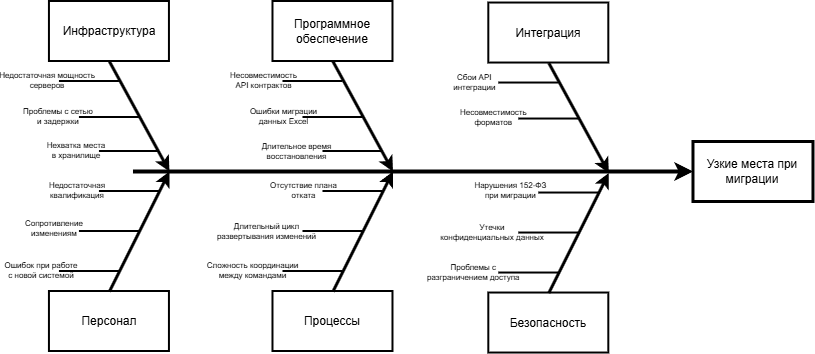

    ## **Потенциальные проблемы при миграции**

### **1. ИНФРАСТРУКТУРА**
**Выявленные проблемы:**
*   Недостаточная мощность серверов для роста нагрузки
*   Проблемы с сетью и задержками
*   Нехватка места в хранилище
#### Предлагаемые решения:
*   Метрики для контроля - 🔴 Высокий приоритет:
    *   CPU/Memory usage: порог 70% с алертами
    *   Disk I/O latency: < 10ms для операций с медицинскими данными
    *   Network throughput: мониторинг задержек между филиалами
    *   Disk free percent: порог 80% с алертами
*   Инструменты - 🔴 Высокий приоритет:
    *   Prometheus + Grafana для сбора метрик
    *   Настройка алертов

### **2. ПРОГРАММНОЕ ОБЕСПЕЧЕНИЕ**
**Выявленные проблемы:**
*   Несовместимость API контрактов между старой и новой системами
*   Ошибки миграции данных Excel
*   Длительное время восстановления (MTTR)
#### Предлагаемые решения:
*   Подход Branch by Abstraction - 🔴 Высокий приоритет:
    *   Создание слоя абстракции над старой системой для постепенной миграции
*   Parallel Run, метрика согласованности данных > 99.9% - 🔴 Высокий приоритет
*   Автоматическая сверка результатов между старой и новой системами - 🟡 Средний приоритет

### **3. ИНТЕГРАЦИЯ**
**Выявленные проблемы:**
*   Сбои API интеграции
*   Несовместимость форматов
#### Предлагаемые решения:
*   Parallel Run для максимальной отладки новых API - 🔴 Высокий приоритет
*   Поэтапный переход на новые API - 🟡 Средний приоритет

### **4. ПЕРСОНАЛ**
**Выявленные проблемы:**
*   Недостаточная квалификация персонала
*   Сопротивление изменениям персонала
*   Ошибок при работе с новой системой
#### Предлагаемые решения:
*   Кросс-функциональные команды по доменам - 🟡 Средний приоритет
*   Совместная проработка новой архитектуры и плана миграции - 🟡 Средний приоритет
*   План обучения и адаптации - 🔴 Высокий приоритет

### **5. ПРОЦЕССЫ**
**Выявленные проблемы:**
*   Отсутствие плана отката
*   Длительный цикл развертывания изменений
*   Сложность координации между командами
#### Предлагаемые решения:
*   Разработка плана отката - 🔴 Высокий приоритет
*   Canary развертывание - 🔴 Высокий приоритет
*   Метрики для контроля:
    *   Deployment Frequency: 2-4 раза в месяц - 🟡 Средний приоритет
    *   Lead Time for Changes: < 14 дней - 🟡 Средний приоритет

### **6. БЕЗОПАСНОСТЬ**
#### Выявленные проблемы:
*   Риск нарушения 152-ФЗ при миграции персональных данных
*   Утечки конфиденциальных данных
*   Проблемы с разграничением доступа
#### Предлагаемые решения:
* Проработка политик разграничения доступа - 🟡 Средний приоритет
* High-Level Design безопасности: - 🔴 Высокий приоритет
    *   Централизованный API Gateway для контроля доступа
    *   Шифрование данных in transit и at rest
    *   Логирование всех операций с персональными данными
*   Parallel Run: сравнение результатов обработки конфиденциальной в старой и новой системах - 🔴 Высокий приоритет
*   Метрики для контроля:
    *   Количество инцидентов с данными: 0 в месяц - 🟡 Средний приоритет
    *   Время обнаружения нарушений: < 1 часа - 🟡 Средний приоритет
    *   Процент сотрудников, прошедших обучение: 100% - 🟢 Низкий приоритет

- - -

## **Система метрик для контроля эффективности**
### **Технические метрики:**
*   **Время ответа API** (< 200ms для критичных endpoints) - 🔴 Высокий приоритет
*   **Доступность системы** (> 99.5% в рабочее время) - 🔴 Высокий приоритет
*   **RTO** (< 4 часа для полного восстановления) - 🔴 Высокий приоритет
*   **RPO** (< 15 минут для финансовых данных) - 🟡 Средний приоритет

### **Бизнес-метрики:**
*   **Время записи пациента** (уменьшение с 10 до 3 минут) - 🟡 Средний приоритет
*   **Скорость обработки анализов** (увеличение на 40%) - 🟡 Средний приоритет
*   **Количество ошибок в данных** (снижение до 0.1%) - 🟢 Низкий приоритет

### **Метрики безопасности:**
*   **Количество инцидентов с данными** (цель: 0 в месяц) - 🔴 Высокий приоритет
*   **Время обнаружения нарушений** (< 1 часа) - 🟡 Средний приоритет
*   **Процент сотрудников, прошедших обучение** (100%) - 🟢 Низкий приоритет